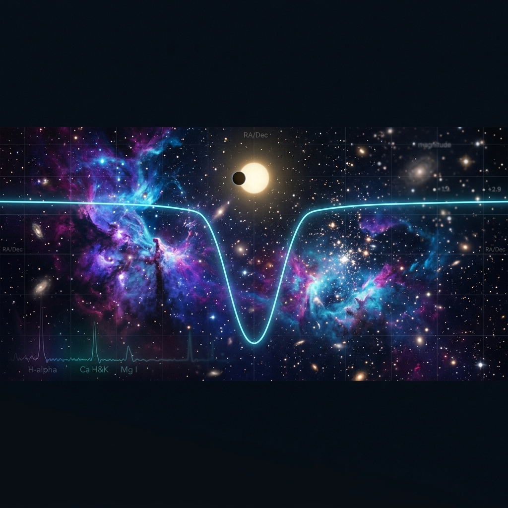
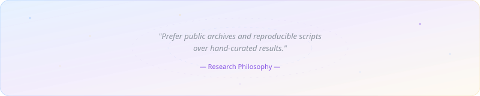

<a href="https://github.com/phanendra09"></a>

<br /><br />

<div align="center">

<h1 align="center" style="border-bottom: none; font-family: 'Outfit', 'Inter', system-ui, -apple-system, sans-serif; font-weight: 700; color: #58A6FF; margin-bottom: 0;">Phanendra Raju</h1>
<p align="center" style="font-family: 'Inter', system-ui, -apple-system, sans-serif; font-size: 16px; color: #8B949E; margin-top: 4px; margin-bottom: 12px;"><strong>Astrophysics Researcher • Research Software Engineer • AI/ML & Cosmos</strong></p>

<!-- ✦ HERO SECTION ✦ -->


<br />

<!-- Social pills -->
<a href="https://github.com/phanendra09"></a>&nbsp;&nbsp;
<a href="https://www.linkedin.com/in/phanendra-raju-40537b291/"></a>&nbsp;&nbsp;
<a href="https://www.instagram.com/phanendra_raju/"></a>&nbsp;&nbsp;
<a href="https://discordapp.com/users/546600002844360734"></a>&nbsp;&nbsp;
<a href="https://x.com/RajuPhanendra"></a>

<br /><br />

&nbsp;&nbsp;
&nbsp;&nbsp;


</div>

<br />

<div align="center"></div>

<br />

<!-- ═══════════════════════════════════════════════════════════════ -->
<!-- ✦ ABOUT ME ✦ -->
<!-- ═══════════════════════════════════════════════════════════════ -->

<table>
<tr>
<td width="50%" valign="top">

###  &nbsp;`whoami`

```python
class Phanendra:
    """Astrophysics researcher who writes code
    to search for biosignatures in the cosmos."""

    name     = "Phanendra Raju"
    location = "Earth → observing the stars"
    
    fields = [
        "Astrophysics Research Software",
        "Astrobiology & Exoplanet Science",
        "AI / ML Systems",
        "Scientific Computing",
    ]
    
    currently_building = {
        "🔬": "M-Dwarf Biosignature Atlas",
        "💫": "Magnetar burst timing analysis",
        "🌟": "Gaia DR3 companion detection",
    }
    
    learning = "Unreal Engine 🎮"
    
    @property
    def motto(self):
        return ("Prefer public archives and "
                "reproducible scripts over "
                "hand-curated results.")
```

</td>
<td width="50%" valign="top" align="center">

###  &nbsp;`stats --live`

<br />


</td>
</tr>
</table>

<br />

<div align="center"></div>

<br />

<!-- ═══════════════════════════════════════════════════════════════ -->
<!-- ✦ TECH STACK ✦ -->
<!-- ═══════════════════════════════════════════════════════════════ -->

<div align="center">

###  &nbsp;Technology Stack

<br />

<!-- Languages row -->
&nbsp;&nbsp;


<br /><br />

<!-- Scientific computing row -->
&nbsp;&nbsp;
&nbsp;
&nbsp;
&nbsp;
&nbsp;


<br /><br />

<!-- Archives row -->
&nbsp;&nbsp;
&nbsp;
&nbsp;
&nbsp;
&nbsp;


<br /><br />

<!-- Tools row -->
&nbsp;&nbsp;
&nbsp;&nbsp;
&nbsp;


</div>

<br />

<div align="center"></div>

<br />

<!-- ═══════════════════════════════════════════════════════════════ -->
<!-- ✦ RESEARCH DOMAINS ✦ -->
<!-- ═══════════════════════════════════════════════════════════════ -->

<div align="center">

###  &nbsp;Research Domains

<br />

<table>
  <tr>
    <td align="center" width="33%">
      <br />
      
      <br /><br />
      <p><sub>
        Screening M-dwarf systems for stellar<br />
        activity, contamination, and biosignature<br />
        false-positive risk.
      </sub></p>
      
      <br /><br />
    </td>
    <td align="center" width="33%">
      <br />
      
      <br /><br />
      <p><sub>
        Studying burst and flare populations<br />
        with event statistics, waiting-time<br />
        tests, and robustness checks.
      </sub></p>
      
      <br /><br />
    </td>
    <td align="center" width="33%">
      <br />
      
      <br /><br />
      <p><sub>
        Building catalog workflows for cross-<br />
        matching, unresolved companions, and<br />
        astrometric anomaly searches.
      </sub></p>
      
      <br /><br />
    </td>
  </tr>
</table>

</div>

<br />

<div align="center"></div>

<br />

<!-- ═══════════════════════════════════════════════════════════════ -->
<!-- ✦ SCIENTIFIC PORTFOLIO ✦ -->
<!-- ═══════════════════════════════════════════════════════════════ -->

<div align="center">

###  &nbsp;Scientific Software Portfolio

<br />

<table>
  <thead>
    <tr>
      <th align="left">Software Package</th>
      <th align="left">Primary Domain</th>
      <th align="left">Core Technology</th>
      <th align="left">Scientific Application</th>
    </tr>
  </thead>
  <tbody>
    <tr>
      <td align="left">🔬 <strong><a href="https://github.com/phanendra09/mdwarf-biosignature-atlas">mdwarf-biosignature-atlas</a></strong></td>
      <td align="left"></td>
      <td align="left"><code>Python</code> <code>Astropy</code> <code>Pandas</code></td>
      <td>Screening M-dwarf systems for biosignature false-positives and stellar activity contamination.</td>
    </tr>
    <tr>
      <td align="left">💫 <strong><a href="https://github.com/phanendra09/magnetar-frb-analysis">magnetar-frb-analysis</a></strong></td>
      <td align="left"></td>
      <td align="left"><code>Python</code> <code>SciPy</code> <code>Matplotlib</code></td>
      <td>Timing, wait-time statistics, and waiting-time populations of magnetar burst systems.</td>
    </tr>
    <tr>
      <td align="left">🌟 <strong><a href="https://github.com/phanendra09/gaia-invisible-companions">gaia-invisible-companions</a></strong></td>
      <td align="left"></td>
      <td align="left"><code>Python</code> <code>Gaia_DR3</code> <code>Pytest</code></td>
      <td>Astrometric anomaly searches and companion detection algorithms at Gaia-scale.</td>
    </tr>
    <tr>
      <td align="left">🌋 <strong><a href="https://github.com/phanendra09/stellar-flare-avalanches">stellar-flare-avalanches</a></strong></td>
      <td align="left"></td>
      <td align="left"><code>Rust</code> <code>NumPy</code> <code>Ruff</code></td>
      <td>Modeling and statistics of stellar flare waits, energy distributions, and event rates.</td>
    </tr>
    <tr>
      <td align="left">🏗️ <strong><a href="https://github.com/phanendra09/phoenix-cluster-feedback">phoenix-cluster-feedback</a></strong></td>
      <td align="left"></td>
      <td align="left"><code>TeX</code> <code>LaTeX</code> <code>Julia</code></td>
      <td>AGN feedback modeling and cooling flow analysis in galaxy clusters.</td>
    </tr>
    <tr>
      <td align="left">⚖️ <strong><a href="https://github.com/phanendra09/LexLogic">LexLogic</a></strong></td>
      <td align="left"></td>
      <td align="left"><code>Python</code> <code>AI</code> <code>Logic</code></td>
      <td>AI-based legal reasoning system using SLD resolution and Horn clauses.</td>
    </tr>
  </tbody>
</table>

</div>

<br />

<div align="center"></div>

<br />

<!-- ═══════════════════════════════════════════════════════════════ -->
<!-- ✦ CONTRIBUTION GALAXY ✦ -->
<!-- ═══════════════════════════════════════════════════════════════ -->

<div align="center">

###  &nbsp;Contribution Galaxy

<br />


<br />

<!-- GitHub Profile Summary Cards -->


<br /><br />

&nbsp;
&nbsp;


</div>

<br />

<div align="center"></div>

<br />

<!-- ═══════════════════════════════════════════════════════════════ -->
<!-- ✦ PHILOSOPHY ✦ -->
<!-- ═══════════════════════════════════════════════════════════════ -->

<div align="center">

###  &nbsp;Research Philosophy

<br />



<br />

<table>
<tr>
<td align="center" width="50%">

> 🧪 &nbsp;*Keep scientific claims separate from diagnostic or screening labels.*

</td>
<td align="center" width="50%">

> ✅ &nbsp;*Write tests for edge cases, not just the happy path.*

</td>
</tr>
<tr>
<td align="center" colspan="2">

> 📊 &nbsp;*Treat visualizations as scientific checks, not decoration.*

</td>
</tr>
</table>

</div>

<br />

<div align="center"></div>

<br />

<!-- ═══════════════════════════════════════════════════════════════ -->
<!-- ✦ FOOTER ✦ -->
<!-- ═══════════════════════════════════════════════════════════════ -->

<div align="center">


<br /><br />

<a href="https://github.com/phanendra09"></a>&nbsp;&nbsp;
<a href="https://www.linkedin.com/in/phanendra-raju-40537b291/"></a>&nbsp;&nbsp;
<a href="https://x.com/RajuPhanendra"></a>

<br /><br />

<sub>✦ Built with passion for science and open source ✦</sub>

</div>


